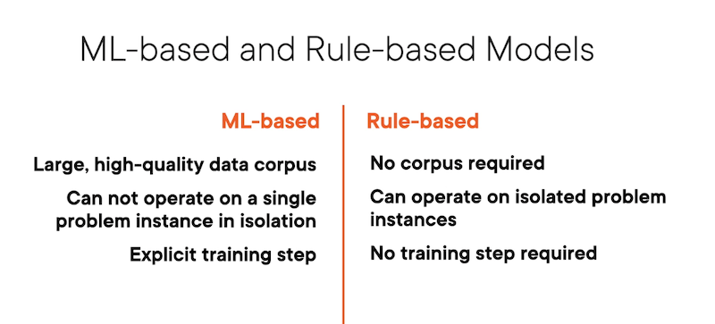
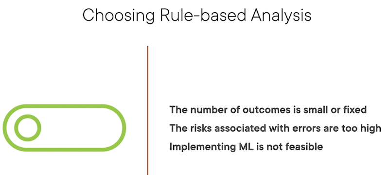
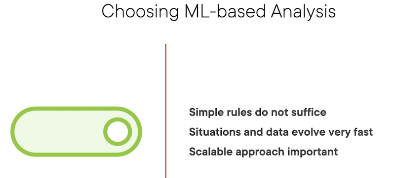

## Rule Based Learning

- Definition: Rule-based systems generate pre-defined outputs on the basis of previously programmed rules which are _hard-coded_ in the system.
- Practically this means the internal logic of the program will need to be modified each time outputs desired to be changed.
- Rules take the simple _{IF:THEN}_ epression.

### Components of Rule-Basded System

- Set of Facts: This is domain specific knowledge. Could be a database holding _true_ information.
- Set of Rules: Rules engine which makes up knowledge base. IF:THEN conditions. These represent relationship between facts and conclusions.
- Inference Engine: Capable of deriving conclusions. Extracts or parses relevant details from the problem instance.

#### Example:

- **Set of Facts:** 1) Fish breathe using gills. 2) There is a portion of water that is disolved oxygen.
- **Set of Rules:** 1) If Fish, then breathes using gills. 2) If water, then contains disolved oxygen.
- **Inference Engine:** Problem: A freshwater bass was found in Lake Minnetonka -> Inference: The bass breathes oxygen from the water through its gills.

### Rule-Based Systems vs ML-Based Systems

#### Rule-Based Analysis

- RBS utilize a simple problem statement.
- RBS rules are straightforward and can be easily codified.
- RBS rules change infrequently
- RBS requires fewer problem instances than ML models do, an advantage.

#### ML-Based Analysis

- Problem statement is reasonably complex
- Difficult to find patterns using visualizations and other exploratory tools
- Decision variables are sensitive to data and _will_ require changing as new information is received _(feedback or backpropagation, etc)_
- Large corpus of data needs to be available to train models

